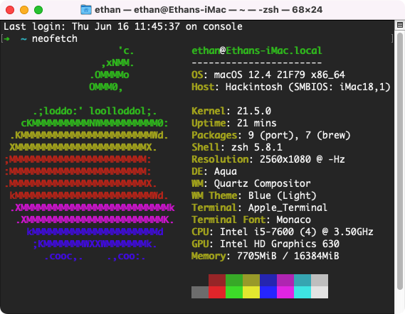
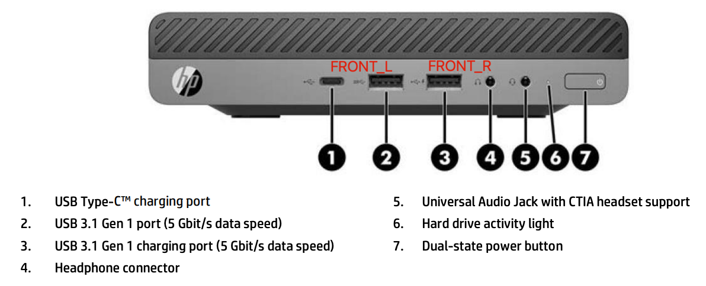
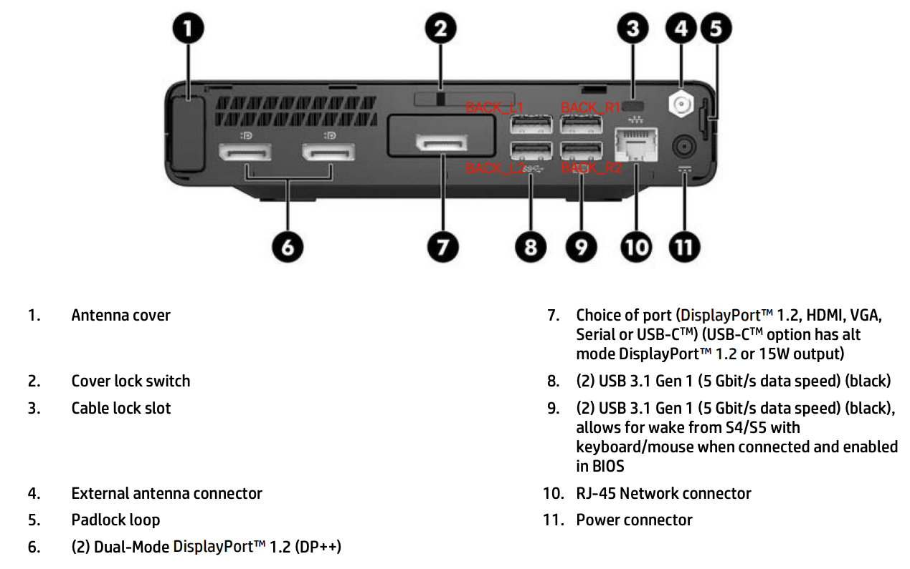
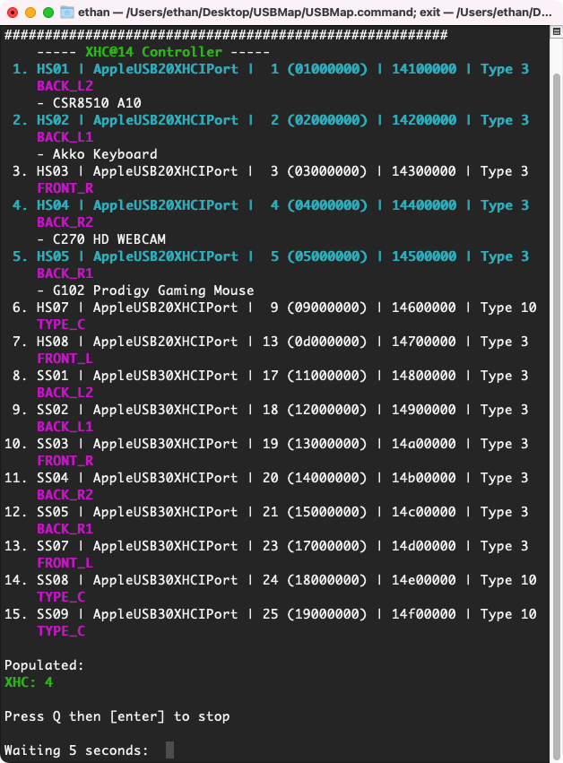
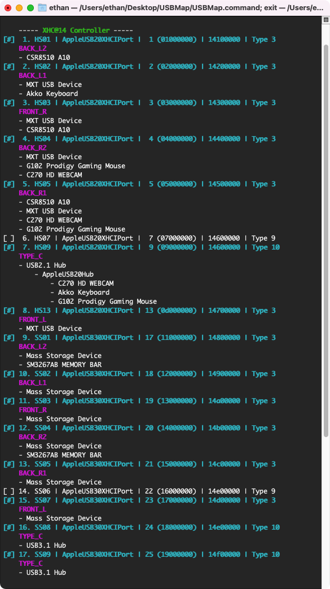

# OpenCore Hackintosh on HP EliteDesk 800 G3 


This is a repository where I store files that were configured to run macOS properly on HP EliteDesk 800 G3.

You can use the EFI folder or refer to the configurations here to make your own bootable macOS installation USB. More information on creating bootable macOS installation USB please checkout the [official guide](https://dortania.github.io/OpenCore-Install-Guide/installer-guide/) from OpenCore. If you are on the same HP model or system, you can copy or modify my EFI folder and place it into EFI partition of your USB.

Explainations for files and configurations are presented in way that user can understand and apply for his/her own PC with the same system or model.

>**Disclaimer**: I do not own any responsibilities if your PC running into problems by patching the files or applying the guide here. Please do your own research.

## PC specifications 🧾

<div align="center">

</div>
<div align="center">
Figure 1. Front face of model
</div>
<br/>

<div align="center">

</div>
<div align="center">
Figure 2. Back face of model
</div>
<br/>

<div align="center">

<div align="center">
<b>SPECIFICATIONS TABLE</b>
</div>

| NAME |  DESCRIPTION |
|------|:-----------:|
| Model name | HP EliteDesk 800 G3 Desktop Mini Business PC (65W) |
| OS | macOS Monterey 12.4 |
| CPU | 3,5 GHz Quad-Core - Intel Core i5-7600 |
| Memory | 16GB (8GB x 2) - Hynix/Hyundai DDR4 2400 MHz |
| Graphics | Intel HD Graphics 630 |
| Monitor | LG 29WN600 |
| Wi-Fi | Broadcom BCM94360CS2 |
| Bluetooth | ORICO BT-403 |
| Storage | 250 GB - CRUCIAL NVME CT250P2SSD8 |
| Storage | 1 TB - WDC SATA III WD10JPVX-75JC3T0 |
| BIOS | 447.60.3.0.0 |
| OpenCore | 0.8.1 |

</div>

## WORKING & NOT WORKING 

### Working ✅

- Almost everything from Apple services
- All USB ports (including USB-C port)
- All DisplayPort
- Both audio ports on the front face
- Wi-Fi
- Bluetooth
- Graphics acceleration
- NVME SSD
- Boot chime
- Sleep
- AirDrop
- Hand-off

### Not working ❌

- Apple TV (can open but video is not streamed) &rarr; finding way to fix. (Update: AppleTV uses DRM, the DRM fix from WhateverGreen has been broken since macOS 10.12.3, you will need a dGPU to address this issue)

### Unchecked / tested ❓

- VGA port
- Ethernet port

##  BIOS SETUP 💾

>**Required**: Please reset your BIOS to default settings before this

- **Advanced &rarr; Boot Options**

    - Disable **Fast Boot**
    - Enable **USB Storage Boot**
    - UEFI Boot order, place your bootable macOS installation USB on the first row otherwise you will need to choose it when system restarts by pressing **F10** &rarr; your USB.
    - Other settings remain default

- **Advanced &rarr; Secure Boot Configuration**

    - Select **Legacy Support Disable and Secure Boot Disable**
    - Other settings remain default

- **Advanced &rarr; System Options**

    - Enable **Virtualization Technology (VTx)**
    - Disable **Virtualization Technology for Directed I/O (VTd)**
    - Enable **M.2 SSD** if you're using a NVME SSD
    - Check **M.2 WLAN/BT** (Uncheck it if have interruption issues)
    - Check **Allow PCIe/PCI SERR# Interrupt** (Uncheck it if have interruption issues)
    - Other settings remain default

- **Advanced &rarr; Built-in Device Options**

    - Disable **Wake on LAN**
    - Set **Video memory size** to **64MB** or larger
    - Disable **LAN/WLAN Auto Switching**
    - Disable **Wake on Wake on USB**
    - Other settings remain default

>**Notice**: Make sure to save your settings before restarting

## SSDTs 🗂

Below are three SSDTs required for my system.
To find SSDTs for your system, please refer to [this document](https://dortania.github.io/Getting-Started-With-ACPI/ssdt-methods/ssdt-prebuilt.html).

- SSDT-EC-USBX-DESKTOP.aml
- SSDT-PLUG-DRTNIA.aml
- SSDT-EC-USBX-DESKTOP.aml

>Location: `EFI/OC/ACPI/`

## DRIVERS 🗳

**Required**

- HfsPlus.efi
- OpenRuntime.efi

**Optional**

- OpenCanopy.efi (for enabling OpenCore GUI bootloader)
- AudioDxe.efi (for enabling boot chime)

>Location: `EFI/OC/Drivers/`            

## KEXTS 💉

**Required**

- [Lilu.kext](https://github.com/acidanthera/Lilu)
- [WhateverGreen.kext](https://github.com/acidanthera/WhateverGreen)
- [VirtualSMC.kext](https://github.com/acidanthera/VirtualSMC)
- [USBInjectAll.kext](https://github.com/Sniki/OS-X-USB-Inject-All/releases/tag/v0.7.6)
- [AppleALC.kext](https://github.com/acidanthera/AppleALC)
- [IntelMausi.kext](https://github.com/acidanthera/IntelMausi)

>Notice: `itlwm.kext` and `IntelBluetoothFirmware.kext` must be on the same version.

**Optional**

- SMCProcessor.kext (for monitoring CPU temperature, included in `VirtualSMC` package)
- SMCSuperIO.kext (for monitoring fan speed, included in `VirtualSMC` package)
- [CPUFriend.kext](https://github.com/stevezhengshiqi/one-key-cpufriend) (CPU power management, please ignore if you are not certain about this one) 
- CPUFriendDataProvider.kext (same as `CPUFriend.kext`)
- [NVMeFix.kext](https://github.com/acidanthera/NVMeFix) (for fixing power and energy consumption on NVME SSD, only use if you are having a NVME SSD)

>Location: `EFI/OC/Kexts/`

## USB PORTS MAPPING ⌗ (deprecated &rarr; switched to Hackintool mapping)

This section aims to introduce you on how to make a `USBMap.kext` to properly make all of your USB ports working.   
If all of your USB ports are working as normal, please ignore this part and remove the `USBMap.kext` out of the `EFI/OC/Kexts/` folder and also in the entry of OpenCore (`config.plist` file).     
Without this `USBMap.kext`, all of my USB ports will work except for one port `BACK_L2` as in Figure 2. Therefore, I need to make the kext file and make this port works.

- What you need?
    - Basic knowledge on USB types (which you can read from [here](https://dortania.github.io/OpenCore-Post-Install/usb/#macos-and-the-15-port-limit))
    - USBMap utility, which can be found [here](https://github.com/corpnewt/USBMap)
    - A USB 2.0 device
    - A USB 3.0 device
    - A USB C device

### Step 1: Discover USB 2.0 ports

Entering the ports discovery by openning `USBMap.command` &rarr; press `D` then `Enter`.    
You will be plugging your USB 2.0 device into each port of your PC, each time you plug in, make sure you wait until the program to recognize the USB device and its port.  
You will be asked for renaming the port when a new USB device is recognized by the program, press `N` and name a port for whatever name you want. For easy mapping, I would suggest to name the port based on its position (you can refer to Figure 1 and Figure 2 for port positions)

### Step 2: Discover USB 3.0 ports

Replicate `Step 1`, but in this step you will be using a USB 3.0 device.    
Again, put a name that refers to the port positions, you can enter the same name as in `Step 1`, just make sure the position name is correct.

### Step 3: Discover USB C device

Replicate `Step 1`, and this step will require you to plug in USB C device.     
Place USB C based on the position again. As I have only one USB C port, so I will name all the USB C ports found by `TYPE_C`.
>Notice: A USB C device in my case will requrie three ports (one will be recogized as USB 2.0 device and two will be USB 3.0 device, they are port 6, 14, 15 as from Figure 3)

<div align="center">

<div align="center">
Figure 3. USB ports after mapping
</div>
</div>

### Step 4: Define USB ports

After completing all the steps above, you will be required to define the type of all discovered ports.      
From the current screen in Figure 3, press `Q` and then `P` &rarr; `Enter` to the build kext step.    
You can also enable a port in the list by entering: `port:On`, replace the `port` with the port number shown in the screen which you found it's being disabled from the screen as in Figure 4.     
From my specific model, since all the ports were USB 3.0 type so I can easily define them by entering e.g: `T:1,2,3,4,5:3` and `Enter` (replace `1,2,3,4,5` by actual port you found on the screen, with USB 2.0 you will need to change `:3` at the end by `:0`).  
There are three USB C ports so I can define them by `T:6,14,15:10`.

<div align="center">

<div align="center">
Figure 4. USB ports after fully defined
</div>
</div>

### Step 5: Build & apply

At this step, after fully defining all the ports, press `K` and `Enter` to build `USBMap.kext` (for Catalina and newer OS) or `USBMapLegacy.kext` (for Mojave and older OS).
Copy `USBMap.kext` or `USBMapLegacy.kext` into `EFI/OC/Kexts/`, edit `config.plist` by adding new entry that point to this kext.    

Reboot, and all my ports work. ✅

## SPECIFIC CONFIGURATIONS

### Boot arguments

**Required (only remove when you are good with your set up)**

- `-v`: boot macOS in verbose mode
- `debug=0x100`: prevents macOS not to reboot when facing a kernel panic, this will help giving you some insights why the system is not booting.
- `keepsyms=1`: prints the symbols during a kernel panic.

**Extras**  

You will notice that the `boot-args` from my `config.plist` file has the argument `alcid=20`. It will be needed for playing boot chime with internal audio. The number `20` is layout ID for my Conexant audio device, which you can find all the supported coded in this [page](https://github.com/acidanthera/AppleALC/wiki/Supported-codecs).

Also, there is an extra argument `igfxonln=1` that I aimed to force all displays online for fixing wake issue (but not helped at all). You may want to delete this argument.

>So literally you will need this in your `boot-args`: `-v debug=0x100 keepsyms=1 alcid=xx`, with `xx` is your audio layout ID.


### Graphics acceleration

Follow the guide over [here](https://github.com/dortania/vanilla-laptop-guide-legacy/tree/master/OpenCore/config-laptop.plist) by choosing your correct CPU model name.     
From my system on Kaby Lake and Intel Graphics HD 630, I will need to set
- AAPL,ig-platform-id   |   DATA    |   <00001659>      

under `PciRoot(0x0)/Pci(0x2,0x0)` from `DeviceProperties` section of `config.plist` file.

>Notice: If you are on HD 630, it's safe to choose <00001659> as <00001B59> caused an issue for one of my DisplayPorts (not receive signal after booting).

### GUI bootloader and Boot chime
Follow the guide from OpenCore [here](https://dortania.github.io/OpenCore-Post-Install/cosmetic/gui.html#setting-up-boot-chime-with-audiodxe)

**GUI bootloader**  
I already included the EFI folder that contains Resources for a GUI bootloader, and also configured the `config.plist`.     
If you want to modify the theme, feel free to change it from the property `Misc -> Boot -> PickerVariant` of `config.plist` file. Options can be found [here](https://dortania.github.io/OpenCore-Post-Install/cosmetic/gui.html#setting-up-opencore-s-gui).

**Boot chime**
>Important: if you are not using my EFI folder, make sure you have `AudioDxe.efi` in your `EFI/OC/Drivers/` and it must be on the same OpenCore version with `HfsPlus.efi` and `OpenRuntime.efi`.

You need to define two things below in order to get boot chime:
- `AudioCodec`: go to Terminal and run:
```
ioreg -rxn IOHDACodecDevice | grep IOHDACodecAddress
```
Then you will probably see this:
```
  |   "IOHDACodecAddress" = 0x0
  |   "IOHDACodecAddress" = 0x2
```
There will be few lines appear on Terminal, mostly will be two. First is the internal audio (in my case that is the Conexant one), and the second one will be HDMI/DVI sound. In this case I will pick `0x0` for the `AudioCodec` as I want to play boot chime from the internal audio.     
You can change it to another value appears, if it won't work, just switch to another one.

- `AudioDevice`: run [gfxutil](https://github.com/acidanthera/gfxutil/releases) to find the path
```
/path/to/gfxutil -f HDEF
```
You will receive something like this:
```
00:1f.3 8086:a2f0 /PCI0@0/HDEF@1F,3 = PciRoot(0x0)/Pci(0x1F,0x3)
```
Grab the right part after the `=`, in my case it would be `PciRoot(0x0)/Pci(0x1F,0x3)`.

>After get the `AudioCodec` and `AudioDevice`, put them under `UEFI -> Audio`. Other configurations I have already made, you can change the others if you know.

## CONTRIBUTION 🤝

Contributions are always welcomed. Please make a Pull request from your side, I will review and merge if it looks good.
